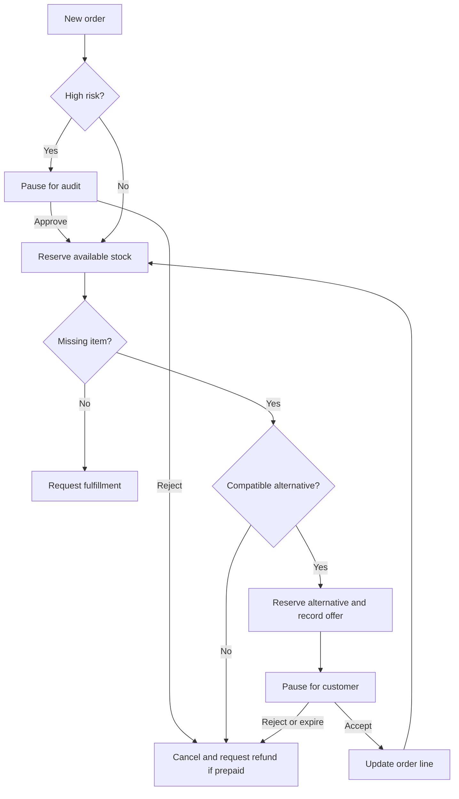

# OrderOps AI: Step-by-step project guide

## 1. Pehle MVP ka scope samjhein

Aap ke BRD ke mutabiq order intake se le kar fulfillment request ya refund request
tak workflow banana hai. Is ZIP mein complete starter source code hai; aap files ko
neeche diye gaye order mein parh kar implement aur run kar sakte hain.

MVP ki assumptions:

- Ek order mein 1–50 unique product lines hain. Quantity positive integer hai.
- Currency PKR hai. Database amounts **paisa** mein store karta hai: 100 paisa = PKR 1.
- High risk ka demo threshold `0.8` hai: score `>= 0.8` par manual review.
- Har missing line par ek compatible alternative offer hota hai. Discount default 5%,
  configured upper bound 10%; final offered unit price original unit price se zyada nahi.
- Compatibility merchant-curated `substitution_group` se aati hai. Same broad category
  ka matlab automatically compatible nahi: pack size, product type aur restrictions
  merchant ko group banate waqt validate karne hain. Customer dietary constraints ka
  dedicated model abhi included nahi; real rollout mein add karein.
- `preferred_brands` ranking preference hai, mandatory brand restriction nahi.
- Offer 24 hours valid rehta hai. Original available lines aur offered replacement
  ka stock reserve hota hai. Rejection, expiry ya suitable alternative na milne par
  **poora order** cancel hota hai aur saare holds release hote hain.
- Prepaid ko demo mein already fully paid samjha gaya hai. Cancel par full refund
  request banti hai. Cheaper accepted replacement par price-difference refund request.
  COD cancellation par money refund nahi banta.
- Messages/refunds/warehouse calls outbox mein record hote hain; koi real provider
  connect nahi hai. `ready_for_fulfillment` dispatch complete hone ka claim nahi.
- Human auditor aur customer alag decision makers hain. Audit protected admin API se,
  customer reply sirf us offer ke token se aata hai.

Is version mein free-form bargaining/counteroffers nahi; structured accept/reject
flow hai. Multi-item orders mein next missing line ke liye graph cycle repeat hota hai.

## 2. Workflow dekhein



Customer ke wait ke liye HTTP request ko 24 hours open nahi rakhna. LangGraph
`interrupt()` par checkpoint save karta hai. Worker same `thread_id = order_id`
ke saath `Command(resume=decision)` bhejta hai. Application data aur checkpoint
alag transactions hain; isliye stock/order/outbox effects ko replay-safe rakha gaya hai.

## 3. Tools install karein aur folder banayein

Required: Python 3.12, Docker with Compose, code editor. Postman optional hai kyunke
FastAPI Swagger UI included hai. Default demo ko LLM API key nahi chahiye.

ZIP extract karein; terminal `orderops-ai` folder mein open karein. Commands isi
folder se chalani hain, warna `.env`, imports aur Alembic config nahi milenge.

Windows **Command Prompt**:

```bat
py -3.12 -m venv .venv
.venv\Scripts\activate.bat
python -m pip install -r requirements.lock.txt
copy .env.example .env
```

Linux/macOS:

```bash
python3.12 -m venv .venv
source .venv/bin/activate
python -m pip install -r requirements.lock.txt
cp .env.example .env
```

PowerShell mein activation blocked ho to environment activate karna zaroori nahi:

```powershell
.\.venv\Scripts\python.exe -m pip install -r requirements.lock.txt
.\.venv\Scripts\python.exe -m uvicorn app.main:app --reload
```

Baqi `python -m ...` commands ko bhi isi executable ke saath chala sakte hain.
`requirements.lock.txt` tested resolved versions deta hai; `requirements.txt`
maintainable version ranges hain. Dependencies update karein to tests dobara chalayein.

## 4. PostgreSQL aur environment configure karein

```bash
docker compose up -d --wait db
```

`compose.yaml` local PostgreSQL create karta hai aur named volume mein data rakhta hai.
`.env.example` ke connection strings local Compose configuration se match karte hain.

| Setting | Kaam |
|---|---|
| `DATABASE_URL` | SQLAlchemy URL; `postgresql+psycopg://...` |
| `CHECKPOINT_DB_URL` | LangGraph/psycopg URL; `postgresql://...` |
| `ADMIN_API_KEY` | Trusted integration/admin endpoints ki key |
| `RISK_THRESHOLD` | Manual audit threshold |
| `DISCOUNT_BPS` | Basis points: 500 = 5% |
| `OFFER_TTL_HOURS` | Customer answer deadline |
| `WORKER_POLL_SECONDS` | Queue polling interval |
| `AGENT_MODE` | `rules` default, optional `ollama` |

Demo credentials sirf local development ke liye hain. `.env` source control mein
commit na karein. Neon use karna ho to dashboard se apne connection strings lein;
SQLAlchemy URL ka driver prefix adjust karein, provider ka SSL configuration retain
karein. Checkpoint/migration setup ke liye direct connection use karke verify karein.
Ye starter Neon-specific pooling deployment ke against test nahi hua.

## 5. Models aur migrations create karein

Pehle `app/config.py`, `app/db.py`, `app/models.py` parhein.

| Table | Stored information |
|---|---|
| `products` | Name, brand, compatibility group, unit price, available stock |
| `orders` | Trusted intake reference, risk, payment type, totals, status |
| `order_lines` | Original/current product, quantity, current price, stock hold |
| `offers` | Replacement, quoted price, deadline, token hash, customer decision |
| `outbox` | Intended message/payment/warehouse action with unique event key |
| `audit_events` | Business decision history |
| `jobs` | Persistent work flag, retry count and next attempt time |

Application schema apply karein:

```bash
python -m alembic upgrade head
```

LangGraph apni checkpoint tables manage karta hai. First setup par:

```bash
python -m scripts.init_checkpoints
```

Ye dono alag setup steps hain. Future model change ke baad:

```bash
python -m alembic revision --autogenerate -m "describe schema change"
```

Generated migration review karein, phir `python -m alembic upgrade head` chalayein.
Initial migration explicit table definitions use karti hai; future model imports
se purani migration ka meaning change nahi hota.

## 6. Sample inventory insert karein

```bash
python -m scripts.seed
```

| ID | Product | Stock | Demo price |
|---|---|---:|---:|
| 1 | Tapal Danedar Tea 450g | 0 | PKR 1,000 |
| 2 | Vital Tea 450g | 20 | PKR 980 |
| 3 | Dalda Cooking Oil 1L | 10 | PKR 600 |
| 4 | Mezan Cooking Oil 1L | 0 | PKR 590 |
| 5 | Basmati Rice 1kg | 0 | PKR 350 |

Prices aur stock fictional demo values hain. Seed dobara chalane se existing stock
reset nahi hota. IDs 1 aur 2 same curated group mein hain; rice ka alternative nahi.

## 7. FastAPI intake aur validation samjhein

`app/schemas.py` request data validate karta hai. `app/main.py` order aur persistent
job ko ek transaction mein save karke HTTP 202 return karta hai. Worker baad mein
processing karta hai. Risk score missing/invalid ho to request reject hoti hai;
system silently risk zero assume nahi karta.

`external_id` upstream order identifier hai. Same ID aur same body retry par same
order return hota hai. Same ID with different body HTTP 409 deta hai. Is se webhook
retries duplicate orders nahi banate. Payload ordering canonicalization limited hai:
lists ki ordering same rakhein.

Current intake prices catalog se snapshot karta hai. Real checkout integration mein
trusted paid line totals, discounts, taxes, shipping, currency aur payment reference
import karein. Public customer ko fraud score ya paid amount set karne ka access na dein.

## 8. Business services build karein

`app/policy.py`: compatible alternatives filter, preference ranking, bounded discount,
aur offer message template. PKR amounts display ke waqt format hote hain; calculations
integer paisa mein hain.

`app/services.py`: each business action database transaction mein execute hota hai.
Stock update se pehle rows lock hoti hain. Demo simplicity ke liye catalog ko sorted
order mein lock kiya gaya hai; large catalog mein affected SKU groups tak locks narrow
karein. Check-stock aur reserve-stock ek atomic operation hona zaroori hai.

Offer transaction mein stock hold + offer + outbox record saath commit hote hain.
Acceptance par hold line ko transfer hota hai; stock dobara decrement nahi hota.
Cancellation par reserved original aur replacement stock wapas hota hai.

Each effect ko replay-safe rakha gaya hai: existing offer reuse, terminal status
guards, unique outbox keys. Is se checkpoint write se pehle process crash ho to
retry same message intent ya stock deduction duplicate nahi karta.

## 9. LangGraph nodes aur conditional edges build karein

`app/graph.py` mein `OrderState` sirf workflow identifiers/decisions rakhta hai;
business truth database se read hoti hai.

| Node | Role |
|---|---|
| `fraud` | Risk threshold evaluate |
| `manual` | Audit flag + `interrupt()` |
| `inventory` | Available quantities reserve, next missing line identify |
| `offer` | Alternative choose/reserve and offer record |
| `wait_customer` | `interrupt()` until explicit decision |
| `apply` | Accepted replacement apply |
| `fulfill` | Warehouse intent and any prepaid adjustment record |
| `cancel` | Holds release, prepaid refund/COD cancellation intent |

`apply → inventory` cyclic edge next missing item handle karta hai. 50 lines ki
limit aur recursion limit 350 traversal ko bound karti hain. Reject par naya offer
nahi hota; ye aap ke reject → refund BRD rule ko follow karta hai.

`interrupt()` resume hone par node start se dobara chal sakta hai. Message send
ko waiting node mein rakhna duplicate emails cause kar sakta hai; isi liye outbox
creation separate replay-safe service mein hai.

## 10. Worker start karein

Terminal 1, activated environment:

```bash
python -m uvicorn app.main:app --reload
```

Terminal 2, same folder aur environment:

```bash
python -m app.worker
```

Worker pending job `FOR UPDATE SKIP LOCKED` se claim karta hai. Har order ka single
job row graph execution aur callback writes serialize karta hai. Graph nodes apni
separate transactions use karte hain; worker **job** row lock karta hai, order row nahi.

Graph pehli baar initial input se start hota hai. Interrupt par persisted customer
ya audit decision read karke resume hota hai. Unfinished node recovery ke liye
`graph.invoke(None, config)` use hota hai. Completed graph ko retry karna no-op hai.

Unexpected errors par max 5 attempts, bounded exponential delay, aur `last_error`
record hota hai. Fix ke baad protected `/orders/{id}/retry` endpoint use karein.
Worker expired offers ko `expired` decision deta hai. Server-authoritative timestamp
use hota hai; timely acceptance worker delay ki wajah se invalidate nahi hoti.

Manual review ka automatic deadline included nahi. Operations team ko pending
audits aur exhausted jobs monitor karne honge. Application data aur LangGraph
checkpoints dono persist rehne chahiye; sirf ek restore karna inconsistent state bana sakta hai.

## 11. Swagger mein end-to-end order test karein

Browser: <http://127.0.0.1:8000/docs>.

1. **Authorize** click karein aur `.env` ka `ADMIN_API_KEY` enter karein.
2. `GET /health` aur `GET /products` execute karein.
3. `POST /orders` mein ye body bhejein:

```json
{
  "external_id": "web-order-1001",
  "customer_email": "customer@example.test",
  "risk_score": 0.1,
  "payment_method": "prepaid",
  "preferred_brands": ["Vital"],
  "items": [{"product_id": 1, "quantity": 1}]
}
```

4. Response se `order_id` copy karein. Brief wait ke baad `GET /orders/{order_id}`
   ka status `awaiting_customer` hona chahiye.
5. `GET /orders/{order_id}/outbox` se `offer_id` aur `payload.token` copy karein.
   Ye demo email hai; email actually send nahi hui.
6. `POST /offers/{offer_id}/reply` execute karein:

```json
{"token": "PASTE_ACTUAL_TOKEN_HERE", "decision": "accept"}
```

7. Worker ke baad order `ready_for_fulfillment`, replacement product ID 2 aur
   final price **PKR 931** hona chahiye. Prepaid difference **PKR 69** ka
   `partial_refund_request` outbox mein hoga. Actual refund pending integration hai.

Automated local demonstration:

```bash
python -m scripts.demo
```

Is script se one order create hota hai aur simulated customer acceptance bheji jati
hai. Real external communications nahi. Demo stock each successful run par consume hota hai.

Additional requests `docs/EXAMPLES.http` mein hain. Har new scenario ke liye new
`external_id` use karein.

## 12. Baqi scenarios verify karein

| Scenario | Input/action | Expected |
|---|---|---|
| In-stock | Product 3, low risk | Ready for fulfillment |
| Audit | Risk 0.95 | Manual review; no stock movement yet |
| Audit approve | `POST /orders/{id}/audit`, `approve` | Stock validation proceeds |
| Audit reject | Same endpoint, `reject` | COD cancelled or prepaid refund pending |
| Customer reject | New product 1 order; reply `reject` | Full-order cancellation, holds released |
| No alternative | Product 5 | Refund pending/COD cancelled |
| Multiple shortages | Products 1 and 4 | Two sequential customer offers |
| Duplicate order | Same exact external ID/body | Original order returned |
| Bad token | Wrong offer token | 404; no state change |
| Repeated reply | Same decision/token | Idempotent success |
| Conflicting reply | Accept then reject | 409 |
| Late reply | Past offer deadline | 410 or 409 if expiry already recorded |
| Expiry | No reply before deadline | Worker cancels and releases holds |

Automated tests:

```bash
python -m pytest -q
```

Tests isolated SQLite aur in-memory checkpoints use karte hain; real PostgreSQL
database modify nahi karte. Expiry time advance karke test hoti hai, 24 hours wait
nahi karna parta. Local test results aur limits `docs/VALIDATION.md` mein hain.

PostgreSQL deployment verify karne ke liye additionally:

1. Offer waiting state mein worker stop/restart karein, phir same offer accept karein.
   Same checkpoint resume hona chahiye; duplicate offer nahi banna chahiye.
2. Do worker processes aur concurrent orders se last-unit stock test karein;
   available stock kabhi negative na ho aur unit ek hi order ko allocate ho.
3. Worker offer creation ke baad terminate karke restart karein; outbox aur stock
   exactly once business effect check karein.
4. DB connection temporarily unavailable ho to error/retry visibility inspect karein.

Ye PostgreSQL concurrency/restart checks is delivered environment mein execute
nahi ho sake; inko deployment gate rakhein.

## 13. Optional LLM enable karein

Default `AGENT_MODE=rules` mein workflow fully testable hai; ye mode LLM inference
perform nahi karta. `app/agent.py` local Ollama `/api/chat` adapter implement karta hai.

Apni machine par Ollama setup karein aur apni available model ID use karein:

```text
AGENT_MODE=ollama
OLLAMA_URL=http://localhost:11434
OLLAMA_MODEL=your-installed-model-id
```

`your-installed-model-id` literal model nahi; usko apne actual installed model se
replace karein. Worker restart karein. Is starter mein model weights bundled nahi hain.

LLM ko sirf eligible candidate facts aur preferred brands milte hain; email, token,
payment credentials nahi milte. Structured output se `product_id` return hota hai.
Output whitelist validate hoti hai, phir stock transaction mein candidate dobara
check hota hai. Invalid output, timeout ya unavailable model par deterministic
fallback use hota hai. Model ko stock mutation, discount setting, approval ya refund
execution authority nahi di gayi. Message financial terms trusted template se aate hain.

Live Ollama integration yahan execute nahi hui; mocked invalid-output test included
hai. Real model ke saath brand preference accuracy aur fallback behavior evaluate karein.

## 14. Real integrations add karne ka order

**A. Store connector:** WooCommerce ya apne checkout se signed order webhook receive
karein. Signature verify, trusted paid-price snapshot import, event ID deduplicate,
phir internal intake service call karein. Existing catalog IDs map karein. Current
API bearer key demo integration ke liye hai, WooCommerce signature handler nahi.

**B. Inventory authority:** Ek authoritative stock system choose karein. Agar store
aur warehouse separately stock update karte hain to local database reservation alone
overselling prevent nahi karegi. Reservation API/atomic upstream write aur reconciliation
implement karein. Current MVP local PostgreSQL ko stock authority assume karta hai.

**C. Outbox dispatcher:** Pending events claim karein; provider request mein unique
`event_key` as idempotency key use karein where supported. Delivery status, provider ID,
attempts, next-attempt time, dead-letter handling aur callbacks add karein. Network send
ke baad crash par provider query/reconciliation chahiye; sirf local `sent` flag exactly-once
delivery guarantee nahi karta. Current `demo_recorded` rows automatically send nahi hote.

**D. Customer channel:** Email ya SMS provider connect karein. Customer-facing offer
page add karein jo product, quantity, old/new totals aur expiry show kare. Explicit
Accept/Reject POST action use karein; email scanner ka GET order modify na kare.
Production mein token redaction, rate limiting, HTTPS, consent preferences aur delivery
failure handling add karein. Natural-language reply ambiguous ho to manual clarification
queue mein bhejein; silence ko acceptance na samjhein.

**E. Payments:** Verified captured payment ID, currency, refundable balance aur provider
status map karein. Full/partial refund request ko gateway adapter consume kare. Provider
confirmation/webhook ke baad hi `refunded` mark karein. COD cancellation ka refund zero.
Tax/shipping/promotions aur multiple captured payments real pricing reconciliation mein
handle karein. Starter ki simple line-total math ko actual checkout totals se replace karein.

**F. Warehouse:** Fulfillment event external idempotent request mein convert karein,
acknowledgement store karein aur stock hold ko picked/consumed inventory state mein
reconcile karein. `ready_for_fulfillment` ke baad dispatch/delivery states add karein.

**G. Operations:** Per-user admin authentication/RBAC, auditor identity, alerting,
worker heartbeat, audit retention, backups, migrations and checkpoint compatibility
review, data access controls, reconciliation tools aur manual-review SLA add karein.
Stuck reservations ka operations action zaroor define karein. Margin/cost floor aur
customer dietary restrictions rollout se pehle pricing/eligibility rules mein add karein.

Ye integrations separate implementation work hain; is starter ke included live features
ke taur par present nahi ki gayi hain.

## 15. Success metrics define karein

Protected `GET /metrics` starter metrics deta hai:

| Metric | Definition |
|---|---|
| Revenue recovery rate | Recovered shortage orders ke final totals / all detected shortage orders ke original totals |
| Order recovery rate | Recovered shortage-order count / detected shortage-order count |
| Processing p50/p95 | Order receipt se first offer queued, fulfillment intent ya cancellation intent tak seconds |
| Exhausted jobs | Jobs with 5 failed attempts |
| Uptime | External monitoring se successful health probes / total scheduled probes |

Revenue aur count recovery alag hain: PKR 1,000 order PKR 931 par recover ho to count
100%, value recovery 93.1% hai. Zero denominator par API `null` deta hai.

Current metrics all-time demo counters hain; `ready_for_fulfillment` recovered outcome
ka proxy hai. Real reporting mein delivered/settled revenue, refunds, discounts,
cancelled-after-recovery orders aur fixed reporting cohorts reconcile karein.
Queued offer ka timestamp actual provider-sent time nahi hai; dispatcher connect
hone par actual send timestamp record karein. `/health` API+DB check hai, full worker
or provider uptime proof nahi. Monitoring mein worker heartbeat aur dependency checks add karein.

## 16. Common errors

| Error | Check |
|---|---|
| Connection refused | Docker database running? `.env` host/port correct? |
| Relation/table does not exist | Alembic aur checkpoint setup dono run hue? |
| Order `received` rehta hai | Separate worker running? Job `last_error` inspect karein |
| 401 | Swagger Authorize key `.env` se match karti hai? |
| 409 on new test | Fresh `external_id` use karein; old ID different payload ke liye nahi |
| Module not found | Correct venv aur project root? `python -m ...` use karein |
| Offer expired | Fresh order/offer create karein; stale token reuse na karein |
| Expected alternative missing | `/products` mein remaining stock aur compatibility group check karein |
| LLM fallback | Model ID, local Ollama process aur configured URL check karein |

## Official references

Implementation patterns official documentation ke against check kiye gaye:

- LangGraph interrupts and node replay: <https://docs.langchain.com/oss/python/langgraph/interrupts>
- LangGraph durable memory/checkpointers: <https://docs.langchain.com/oss/python/langgraph/add-memory>
- FastAPI background task considerations: <https://fastapi.tiangolo.com/tutorial/background-tasks/>
- SQLAlchemy sessions: <https://docs.sqlalchemy.org/en/20/orm/session_basics.html>
- Alembic tutorial: <https://alembic.sqlalchemy.org/en/latest/tutorial.html>
- Ollama structured output: <https://docs.ollama.com/capabilities/structured-outputs>

Guide/starter prepared: 13 September 2026. Local business rules above are explicit
MVP design choices; documentation does not prescribe your commercial refund policy.
